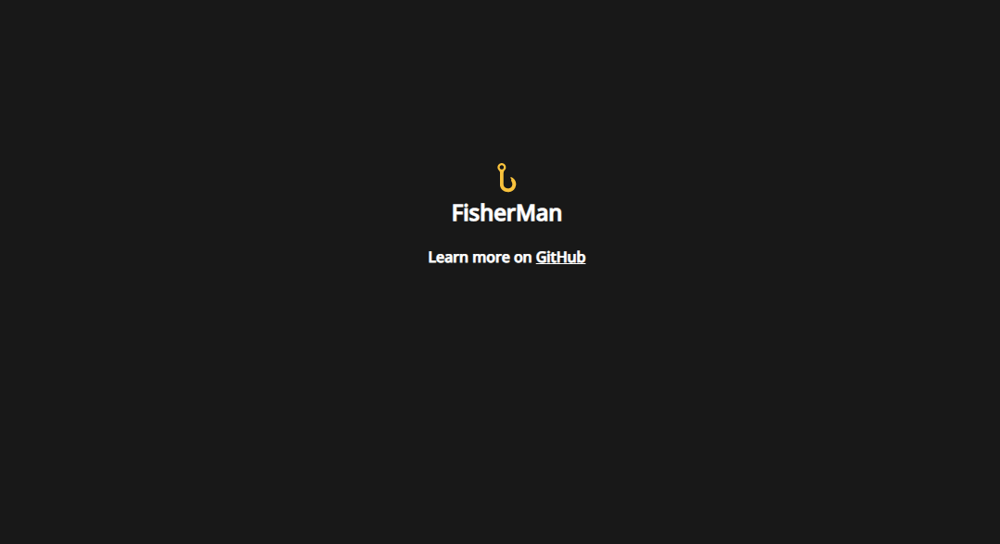

<!--
      .o8                                      .o8                        
     "888                                     "888                        
 .oooo888   .ooooo.  oooo    ooo          .oooo888   .ooooo.  oooo    ooo 
d88' `888  d88' `88b  `88b..8P'          d88' `888  d88' `88b  `88.  .8'  
888   888  888   888    Y888'    8888888 888   888  888ooo888   `88..8'   
888   888  888   888  .o8"'88b           888   888  888    .o    `888'    
`Y8bod88P" `Y8bod8P' o88'   888o         `Y8bod88P" `Y8bod8P'     `8'     
-->

<h1 align="center">🪝<br>Fisherman</h1>

<div align="center">
  <p>
     
     
     
     
  </p>
</div>

<p align="center">
  <b>Fisherman</b> is a simple <b>express.js</b> server, that collects basic <b>client's data</b> on every connection.
</p>

## ✨ Features

- <details>
    <summary>Showing Client's Data</summary>
      <br><b>Including:</b><br>
      &bull; IP Address<br>
      &bull; Geolocation<br>
      &bull; Web Browser<br>
      &bull; Operating System
  </details>
- Easy to use (ready to use in less than 15 minutes)
- Secure (even though it's a simple server, we will develop better and better security)
- Clarity of use (because of used colors pallete)
<br>

## 🖼️ Preview

##### Default landing page:


##### Command-Line:

<br>

## ⚡ Requirements

- [Node.js (and npm)](https://nodejs.org/en/download/s)
- <details>
    <summary>NPM Dependencies</summary>
      &bull; Express.js<br>
      &bull; GeoIP-Lite<br>
      &bull; Ngrok
  </details>
<br>

## 🛠️ Installation

### Linux

``` bash
sudo apt-get update  # Update apt-get
sudo apt-get install nodejs npm git  # Install all dependencies
git clone https://github.com/dox-dev/fisherman.git  # Clone Fisherman repository
cd fisherman  # Enter Fisherman directory
/usr/bin/npm install  # npm will install all required dependencies
```

### Windows
1. Install [Node.js](https://nodejs.org/en/download/)
2. Download [repository zip file](https://github.com/dox-dev/fisherman/archive/refs/heads/main.zip) and extract it to another folder
3. Open the folder, where you extracted repository files with Command Prompt
4. Run `npm install` to install all required dependencies
<br>

## 📦 Setup

#### Create Free Ngrok Account

To use **Fisherman** you need to have **Ngrok account**
To create one, just visit [dashboard.ngrok.com/signup](https://dashboard.ngrok.com/signup) and follow all instructions.

#### Set Your Ngrok Authentication Token

After creating free Ngrok account, go to [dashboard.ngrok.com/get-started/your-authtoken](https://dashboard.ngrok.com/get-started/your-authtoken) and copy your auth token.<br>
Then open `app.js` file and paste your auth token into the "token" variable. Right here:
```js
const app = express()
const port = 8080


// Your ngrok auth token (Get it here: https://dashboard.ngrok.com/get-started/your-authtoken)
const token = 'PUT YOUR AUTH TOKEN HERE'
 
```

#### Finishing Touches

When you'll add your authentication token, you're all set to go. Now you can start your **Fisherman** server, by typing:<br>
``` bash
.\fisherman.sh #Windows
```
or
``` bash
sh fisherman.sh #Linux
```
into your Command-Line.

###### Keep in mind that this tool is in its early development, so there still may be some bugs. Sorry for any inconvenience.
